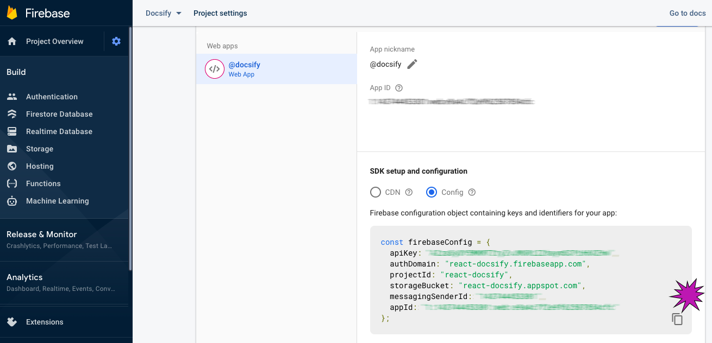

[Home](../README.md) 
## Google Firebase 

> This project optionally uses Google Firebase 

Any Google ID gets a free [Firebase account](https://console.firebase.google.com). It's pay as you go for some features when we need it. Which we don't. Yet. In time we'll easily migrate the software to [Google Cloud Services](https://cloud.google.com/) for scalability

